# SEEKER Component Relationship Diagram

```mermaid
graph TB
    %% Core Components
    subgraph "Core Orchestration Components"
        Orchestration[Orchestration Router<br/>orchestration.py]
        Classification[Classification Engine<br/>classification_engine.py]
        AgentRouter[Agent Router<br/>agent_router.py]
        SAIRLoop[SAIR Loop<br/>sair_loop.py]
    end

    %% Voice Interface Components
    subgraph "Voice Interface Components"
        VoiceJS[Voice Interface<br/>voice-interface.js]
        VoiceTest[Voice Test<br/>test_voice_interface.py]
        VoiceAPI[Voice API Integration<br/>Web Speech API]
    end

    %% Data Models
    subgraph "Data Models"
        TaskRequest[Task_Request<br/>task_request.py]
        AgentResponse[Agent_Response<br/>agent_response.py]
        SAIRData[SAIR_Loop_Data<br/>sair_loop.py]
        UserRequest[UserRequestModel<br/>api_models.py]
        ProcessingResponse[ProcessingResponseModel<br/>api_models.py]
    end

    %% Database Collections
    subgraph "Database Collections"
        TaskRequests[(Task Requests<br/>Collection)]
        AgentResponses[(Agent Responses<br/>Collection)]
        SAIRDataCollection[(SAIR Loop Data<br/>Collection)]
    end

    %% External Voice Services
    subgraph "External Voice Services"
        SpeechRecognition[Speech Recognition<br/>Web Speech API]
        SpeechSynthesis[Speech Synthesis<br/>Web Speech API]
        VoiceTranslation[Voice Translation<br/>Multilingual Support]
    end

    %% Specialized Agents
    subgraph "Specialized AI Agents"
        ProductSearchAgent[Product Search Agent<br/>product_search_agent]
        PriceNegotiationAgent[Price Negotiation Agent<br/>price_negotiation_agent]
        VerificationAgent[Verification Agent<br/>verification_agent]
        SupplyChainAgent[Supply Chain Agent<br/>supply_chain_agent]
        TranslationAgent[Translation Agent<br/>translation_agent]
    end

    %% Connections - Orchestration to Core Services
    Orchestration --> Classification
    Orchestration --> AgentRouter
    Orchestration --> SAIRLoop

    %% Connections - Classification Engine
    Classification --> TaskRequest
    Classification --> AgentResponse
    Classification --> ProductSearchAgent
    Classification --> PriceNegotiationAgent
    Classification --> VerificationAgent
    Classification --> SupplyChainAgent
    Classification --> TranslationAgent

    %% Connections - Voice Interface Integration
    VoiceJS --> VoiceAPI
    VoiceAPI --> SpeechRecognition
    VoiceAPI --> SpeechSynthesis
    VoiceAPI --> VoiceTranslation

    %% Connections - Voice to Orchestration
    VoiceJS -.-> Orchestration
    VoiceTest -.-> Orchestration
    VoiceAPI -.-> Classification

    %% Connections - Data Flow
    Orchestration --> TaskRequests
    Orchestration --> AgentResponses
    Orchestration --> SAIRDataCollection
    Classification --> TaskRequests
    SAIRLoop --> SAIRDataCollection

    %% Connections - Models
    TaskRequest -.-> TaskRequests
    AgentResponse -.-> AgentResponses
    SAIRData -.-> SAIRDataCollection

    %% Connections - Agent Router to Agents
    AgentRouter --> ProductSearchAgent
    AgentRouter --> PriceNegotiationAgent
    AgentRouter --> VerificationAgent
    AgentRouter --> SupplyChainAgent
    AgentRouter --> TranslationAgent

    %% Connections - SAIR Loop Learning
    SAIRLoop --> Classification
    SAIRLoop --> AgentRouter
    SAIRLoop --> VoiceJS

    %% Voice Processing Flow
    VoiceJS --> VoiceTest
    VoiceTest --> VoiceAPI
    VoiceAPI --> Classification

    %% Styling
    classDef orchestration fill:#e3f2fd,stroke:#1976d2,stroke-width:3px
    classDef classification fill:#f3e5f5,stroke:#7b1fa2,stroke-width:3px
    classDef voice fill:#e8f5e8,stroke:#388e3c,stroke-width:3px
    classDef data fill:#fff3e0,stroke:#f57c00,stroke-width:2px
    classDef external fill:#fce4ec,stroke:#c2185b,stroke-width:2px
    classDef agent fill:#f1f8e9,stroke:#689f38,stroke-width:2px

    class Orchestration,AgentRouter,SAIRLoop orchestration
    class Classification classification
    class VoiceJS,VoiceTest,VoiceAPI voice
    class TaskRequest,AgentResponse,SAIRData,UserRequest,ProcessingResponse,TaskRequests,AgentResponses,SAIRDataCollection data
    class SpeechRecognition,SpeechSynthesis,VoiceTranslation external
    class ProductSearchAgent,PriceNegotiationAgent,VerificationAgent,SupplyChainAgent,TranslationAgent agent
```



## Component Relationships Explained:

### 1. Orchestration Router (orchestration.py)
**Primary Role**: Central coordinator for all request processing

**Key Relationships**:
- **Classification Engine**: Calls `classify_request()` to analyze input text
- **Agent Router**: Uses `determine_routing()` to assign optimal agents
- **SAIR Loop**: Integrates with `process_feedback()` for continuous learning
- **Database**: Stores Task_Request, Agent_Response, and SAIR_Loop_Data
- **Voice Interface**: Receives processed voice input for classification

**Core Functions**:
- `process_request()`: Main request processing endpoint
- `get_request_status()`: Status tracking and retrieval
- `process_agent_responses()`: Background task processing
- `update_sair_loop_with_feedback()`: Learning integration

### 2. Classification Engine (classification_engine.py)
**Primary Role**: AI-powered request classification and categorization

**Key Relationships**:
- **Orchestration Router**: Provides classification results for routing decisions
- **Voice Interface**: Processes voice input text for categorization
- **Specialized Agents**: Routes to category-specific agents based on classification
- **SAIR Loop**: Receives feedback for algorithm refinement

**Core Functions**:
- `classify_request()`: Main classification method
- `_calculate_*_score()`: Category-specific scoring algorithms
- `_determine_routing()`: Routing decision based on confidence
- `_calculate_confidence()`: Overall confidence scoring

**Classification Categories**:
- Product Search: Global supplier and product discovery
- Price Negotiation: Pricing optimization and bargaining
- Verification: Authentication and compliance checking
- Supply Chain: Logistics and inventory monitoring
- Translation: Multilingual communication support

### 3. Voice Interface (voice-interface.js)
**Primary Role**: Multilingual voice input processing and synthesis

**Key Relationships**:
- **Orchestration Router**: Sends processed voice input for classification
- **Classification Engine**: Receives voice input for categorization
- **External APIs**: Integrates with Web Speech API for recognition/synthesis
- **SAIR Loop**: Provides voice processing feedback for learning

**Core Functions**:
- `startVoiceInput()`: Initialize speech recognition
- `handleSpeechResult()`: Process speech recognition results
- `processVoiceInput()`: Send voice input to classification
- `testVoiceOutput()`: Speech synthesis testing
- `updateRecognitionLanguage()`: Multilingual support

**Supported Languages**:
- English (en-US), Spanish (es-ES), French (fr-FR)
- German (de-DE), Italian (it-IT), Portuguese (pt-BR)
- Russian (ru-RU), Japanese (ja-JP), Korean (ko-KR), Chinese (zh-CN)

## Data Flow Patterns:

### 1. Voice Input Processing Flow
```
Voice Input → Speech Recognition → Text Conversion → Classification Engine → Orchestration Router → Agent Assignment
```

### 2. Classification Decision Flow
```
Input Text → Keyword Analysis → Category Scoring → Confidence Calculation → Routing Decision → Agent Assignment
```

### 3. Learning Feedback Flow
```
Agent Response → Performance Metrics → SAIR Loop → Algorithm Refinement → Classification Updates → Voice Processing Improvements
```

## Integration Points:

### 1. Voice-to-Classification Integration
- Voice interface converts speech to text
- Text is sent to classification engine for categorization
- Classification results determine routing to specialized agents
- Voice synthesis provides feedback to users

### 2. Classification-to-Orchestration Integration
- Classification engine provides category scores and confidence
- Orchestration router uses results for agent assignment
- Routing decisions are stored in database for tracking
- Performance feedback flows back to classification for learning

### 3. SAIR Loop Learning Integration
- All three components provide performance data to SAIR loop
- SAIR loop refines classification algorithms
- Agent routing weights are updated based on performance
- Voice processing accuracy improves through learning

## Key Features:

### Intelligent Voice Processing
- Real-time speech recognition and synthesis
- Multilingual support for global communication
- Context-aware voice response generation
- Continuous learning for accuracy improvement

### Advanced Classification
- Keyword-based category detection
- Confidence scoring for routing decisions
- Multi-category classification support
- Adaptive learning from feedback

### Seamless Orchestration
- Unified request processing pipeline
- Background task management
- Real-time status tracking
- Performance monitoring and optimization 