# SEEKER Component Relationships - Core Entities Focus

```mermaid
graph TB
    %% Core Entity Models
    subgraph "Core Entity Models"
        User[User Model<br/>user.py]
        Device[Device Model<br/>device.py]
        AIAgent[AI_Agent Model<br/>ai_agent.py]
        TaskRequest[Task_Request Model<br/>task_request.py]
        AgentResponse[Agent_Response Model<br/>agent_response.py]
        SAIRLoopData[SAIR_Loop_Data Model<br/>sair_loop.py]
    end

    %% Database Collections
    subgraph "Database Collections"
        UsersCollection[(Users<br/>Collection)]
        DevicesCollection[(Devices<br/>Collection)]
        AIAgentsCollection[(AI_Agents<br/>Collection)]
        TaskRequestsCollection[(Task Requests<br/>Collection)]
        AgentResponsesCollection[(Agent Responses<br/>Collection)]
        SAIRDataCollection[(SAIR Loop Data<br/>Collection)]
    end

    %% Service Layer Components
    subgraph "Service Layer"
        OrchestrationService[Orchestration Service<br/>orchestration.py]
        ClassificationService[Classification Service<br/>classification_engine.py]
        AgentRouterService[Agent Router Service<br/>agent_router.py]
        SAIRLoopService[SAIR Loop Service<br/>sair_loop.py]
        VoiceService[Voice Service<br/>voice-interface.js]
    end

    %% API Layer Components
    subgraph "API Layer"
        OrchestrationAPI[Orchestration API<br/>orchestration.py]
        UsersAPI[Users API<br/>users.py]
        FilesAPI[Files API<br/>files.py]
        ConversationAPI[Conversation API<br/>conversation.py]
    end

    %% External Systems
    subgraph "External Systems"
        VoiceAPIs[Voice APIs<br/>Web Speech API]
        CommercePlatform[Commerce Platform<br/>consumer_marketplace.py]
        TacticalSystem[Tactical System<br/>video_conference.py]
        ManufacturingSystem[Manufacturing System<br/>manufacturing.py]
    end

    %% MongoDB Database
    subgraph "MongoDB Database"
        MongoDB[(MongoDB<br/>seeker_db)]
    end

    %% Entity Relationships
    %% User Relationships
    User --> UsersCollection
    User --> Device
    User --> TaskRequest
    
    %% Device Relationships
    Device --> DevicesCollection
    Device --> User
    
    %% AI Agent Relationships
    AIAgent --> AIAgentsCollection
    AIAgent --> AgentResponse
    AIAgent --> TaskRequest
    
    %% Task Request Relationships
    TaskRequest --> TaskRequestsCollection
    TaskRequest --> User
    TaskRequest --> AIAgent
    TaskRequest --> AgentResponse
    TaskRequest --> SAIRLoopData
    
    %% Agent Response Relationships
    AgentResponse --> AgentResponsesCollection
    AgentResponse --> TaskRequest
    AgentResponse --> AIAgent
    
    %% SAIR Loop Data Relationships
    SAIRLoopData --> SAIRDataCollection
    SAIRLoopData --> TaskRequest
    SAIRLoopData --> AIAgent
    
    %% Service Layer Relationships
    OrchestrationService --> TaskRequest
    OrchestrationService --> AgentResponse
    OrchestrationService --> SAIRLoopData
    OrchestrationService --> ClassificationService
    OrchestrationService --> AgentRouterService
    OrchestrationService --> SAIRLoopService
    
    ClassificationService --> TaskRequest
    ClassificationService --> AIAgent
    
    AgentRouterService --> AIAgent
    AgentRouterService --> TaskRequest
    AgentRouterService --> SAIRLoopData
    
    SAIRLoopService --> SAIRLoopData
    SAIRLoopService --> AIAgent
    SAIRLoopService --> TaskRequest
    
    VoiceService --> TaskRequest
    VoiceService --> VoiceAPIs
    
    %% API Layer Relationships
    OrchestrationAPI --> OrchestrationService
    OrchestrationAPI --> TaskRequest
    OrchestrationAPI --> AgentResponse
    
    UsersAPI --> User
    UsersAPI --> Device
    
    FilesAPI --> TaskRequest
    FilesAPI --> AgentResponse
    
    ConversationAPI --> User
    ConversationAPI --> TaskRequest
    
    %% External System Relationships
    CommercePlatform --> TaskRequest
    CommercePlatform --> AgentResponse
    
    TacticalSystem --> TaskRequest
    TacticalSystem --> AgentResponse
    
    ManufacturingSystem --> TaskRequest
    ManufacturingSystem --> AgentResponse
    
    %% Database Relationships
    UsersCollection -.-> MongoDB
    DevicesCollection -.-> MongoDB
    AIAgentsCollection -.-> MongoDB
    TaskRequestsCollection -.-> MongoDB
    AgentResponsesCollection -.-> MongoDB
    SAIRDataCollection -.-> MongoDB
    
    %% Data Flow Patterns
    %% Request Flow
    User -.-> TaskRequest
    TaskRequest -.-> AIAgent
    AIAgent -.-> AgentResponse
    AgentResponse -.-> SAIRLoopData
    
    %% Learning Flow
    SAIRLoopData -.-> AIAgent
    AIAgent -.-> TaskRequest
    
    %% Styling
    classDef entityModels fill:#e3f2fd,stroke:#1976d2,stroke-width:3px
    classDef databaseCollections fill:#f3e5f5,stroke:#7b1fa2,stroke-width:2px
    classDef serviceLayer fill:#e8f5e8,stroke:#388e3c,stroke-width:2px
    classDef apiLayer fill:#fff3e0,stroke:#f57c00,stroke-width:2px
    classDef externalSystems fill:#fce4ec,stroke:#c2185b,stroke-width:2px
    classDef mongodb fill:#fafafa,stroke:#424242,stroke-width:3px

    class User,Device,AIAgent,TaskRequest,AgentResponse,SAIRLoopData entityModels
    class UsersCollection,DevicesCollection,AIAgentsCollection,TaskRequestsCollection,AgentResponsesCollection,SAIRDataCollection databaseCollections
    class OrchestrationService,ClassificationService,AgentRouterService,SAIRLoopService,VoiceService serviceLayer
    class OrchestrationAPI,UsersAPI,FilesAPI,ConversationAPI apiLayer
    class VoiceAPIs,CommercePlatform,TacticalSystem,ManufacturingSystem externalSystems
    class MongoDB mongodb
```



## Core Entity Relationships Explained:

### **1. User Entity (user.py)**
**Primary Relationships**:
- **One-to-Many with Device**: A user can have multiple registered devices
- **One-to-Many with Task_Request**: A user can make multiple requests
- **Stored in Users Collection**: MongoDB collection for user data

**Key Attributes**:
- `user_id`: Unique identifier
- `personal_profile`: User profile information
- `device_registrations`: List of registered devices
- `created_at`, `updated_at`: Timestamps

### **2. Device Entity (device.py)**
**Primary Relationships**:
- **Many-to-One with User**: Each device belongs to one user
- **Stored in Devices Collection**: MongoDB collection for device data

**Key Attributes**:
- `device_id`: Unique device identifier
- `user_id`: Reference to owner user
- `device_type`: Type of device (phone, tablet, laptop)
- `hardware_specs`: Device specifications
- `registration_date`, `last_active`: Activity timestamps

### **3. AI_Agent Entity (ai_agent.py)**
**Primary Relationships**:
- **One-to-Many with Agent_Response**: An agent can generate multiple responses
- **Many-to-Many with Task_Request**: Agents can handle multiple requests
- **Stored in AI_Agents Collection**: MongoDB collection for agent data

**Key Attributes**:
- `agent_id`: Unique agent identifier
- `agent_type`: Category/type of agent
- `capabilities`: List of agent capabilities
- `performance_metrics`: Historical performance data
- `routing_weights`: Learning-based routing weights

### **4. Task_Request Entity (task_request.py)**
**Primary Relationships**:
- **Many-to-One with User**: Each request belongs to one user
- **Many-to-Many with AI_Agent**: Multiple agents can process a request
- **One-to-Many with Agent_Response**: A request can have multiple responses
- **One-to-One with SAIR_Loop_Data**: Each request has learning data
- **Stored in Task Requests Collection**: MongoDB collection for request data

**Key Attributes**:
- `request_id`: Unique request identifier
- `user_id`: Reference to requesting user
- `input_text`: User's text input
- `input_audio`: Optional audio input
- `classification_results`: NLP classification results
- `routing_decision`: Agent routing decision
- `created_at`: Request timestamp

### **5. Agent_Response Entity (agent_response.py)**
**Primary Relationships**:
- **Many-to-One with Task_Request**: Each response belongs to one request
- **Many-to-One with AI_Agent**: Each response is from one agent
- **Stored in Agent Responses Collection**: MongoDB collection for response data

**Key Attributes**:
- `response_id`: Unique response identifier
- `request_id`: Reference to parent request
- `agent_id`: Reference to responding agent
- `response_content`: Actual response content
- `response_confidence`: Confidence score (0-1)
- `processing_time`: Time taken to process
- `vector_embedding`: Response vector representation
- `created_at`: Response timestamp

### **6. SAIR_Loop_Data Entity (sair_loop.py)**
**Primary Relationships**:
- **One-to-One with Task_Request**: Each request has one SAIR loop entry
- **Many-to-One with AI_Agent**: Learning data affects agent performance
- **Stored in SAIR Loop Data Collection**: MongoDB collection for learning data

**Key Attributes**:
- `loop_id`: Unique loop identifier
- `request_id`: Reference to related request
- `success_metrics`: Performance metrics
- `learning_updates`: Learning insights
- `routing_adjustments`: Routing optimizations
- `timestamp`: Learning timestamp

## Data Flow Patterns:

### **1. Request Processing Flow**
```
User → Task_Request → AI_Agent → Agent_Response → SAIR_Loop_Data
```

### **2. Learning Feedback Flow**
```
SAIR_Loop_Data → AI_Agent → Task_Request (future requests)
```

### **3. Device Management Flow**
```
User → Device → Device Registration → Activity Tracking
```

### **4. Agent Performance Flow**
```
AI_Agent → Agent_Response → Performance Metrics → Routing Weights
```

## Database Schema Relationships:

### **One-to-Many Relationships**
- User → Devices (one user, many devices)
- User → Task_Requests (one user, many requests)
- Task_Request → Agent_Responses (one request, many responses)
- AI_Agent → Agent_Responses (one agent, many responses)

### **Many-to-Many Relationships**
- Task_Requests ↔ AI_Agents (multiple agents can handle multiple requests)

### **One-to-One Relationships**
- Task_Request ↔ SAIR_Loop_Data (each request has one learning entry)

## Key Features:

### **Comprehensive Entity Tracking**
- Full user and device management
- Complete request lifecycle tracking
- Agent performance monitoring
- Learning data collection

### **Flexible Relationships**
- Support for complex multi-agent processing
- Scalable device management
- Extensible learning system

### **Performance Optimization**
- Vector embeddings for response analysis
- Confidence scoring for quality assurance
- Processing time tracking for optimization

### **Learning Integration**
- SAIR loop data for continuous improvement
- Performance metrics for agent optimization
- Routing weight adjustments based on learning 