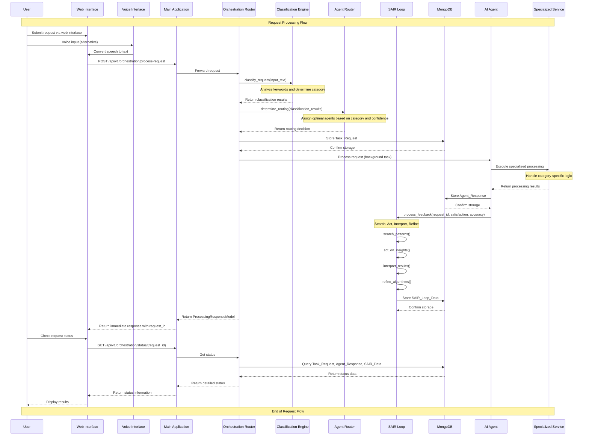

# SEEKER Request Flow Sequence Diagram

## Request Flow Stages:

### 1. User Input Phase
- **Web Interface**: User submits request via form
- **Voice Interface**: Alternative input method with speech-to-text conversion
- **Request Format**: JSON payload with user_id and input_text

### 2. Request Processing Phase
- **Classification Engine**: Analyzes input text using keyword matching
- **Categories**: Product search, price negotiation, verification, supply chain, translation
- **Confidence Scoring**: Determines routing confidence (0-1 scale)
- **Agent Router**: Assigns optimal agents based on category and confidence

### 3. Database Storage Phase
- **Task Request**: Stores initial request with classification and routing data
- **Request ID**: Unique identifier for tracking throughout the process
- **Metadata**: Timestamp, user_id, input_text, classification_results

### 4. Background Processing Phase
- **Agent Assignment**: Routes to specialized AI agents
- **Service Processing**: Category-specific business logic execution
- **Response Generation**: Creates structured agent responses
- **Database Storage**: Stores agent responses with confidence scores

### 5. SAIR Loop Learning Phase
- **Search**: Analyze patterns in recent performance data
- **Act**: Take actions based on insights (threshold adjustments, weight updates)
- **Interpret**: Generate insights from action results
- **Refine**: Update algorithms and routing weights
- **Learning**: Continuous improvement based on feedback

### 6. Response Generation Phase
- **Immediate Response**: Returns request_id and estimated processing time
- **Status Tracking**: Provides endpoint for checking request status
- **Performance Metrics**: Includes confidence scores and routing decisions

### 7. Status Checking Phase
- **Real-time Updates**: Users can check processing status
- **Detailed Information**: Shows task request, agent responses, and SAIR data
- **Completion Status**: Indicates when processing is finished

## Key Features:

### Asynchronous Processing
- Immediate response with request ID
- Background processing for complex tasks
- Real-time status updates

### Intelligent Routing
- AI-powered classification
- Confidence-based agent assignment
- Load balancing across agents

### Continuous Learning
- SAIR loop for performance optimization
- Pattern recognition and adaptation
- Algorithm refinement based on feedback

### Multi-modal Input
- Text-based requests
- Voice input with speech recognition
- Multilingual support (10 languages)

### Comprehensive Tracking
- Full request lifecycle monitoring
- Performance metrics collection
- Learning data storage 