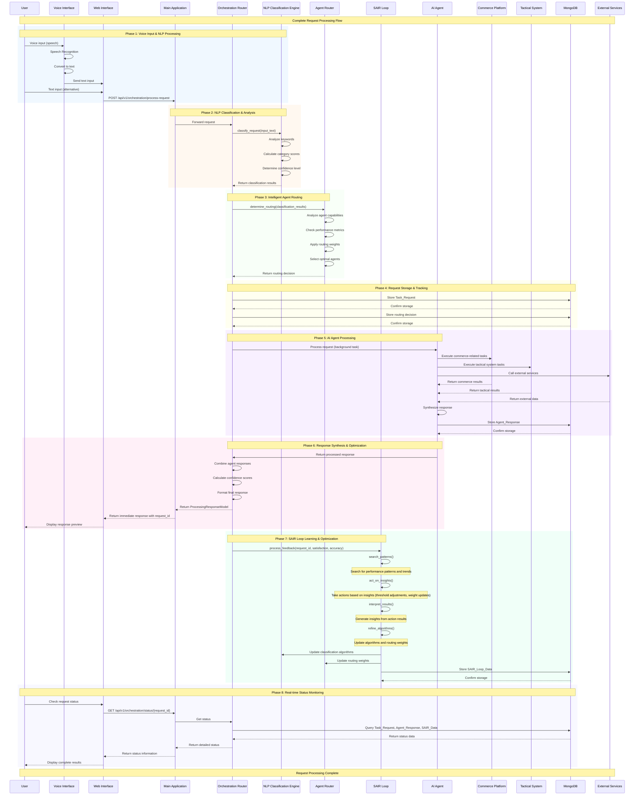

# SEEKER Request Flow Sequence - Comprehensive Overview

## Request Flow Phases Explained:

### **Phase 1: Voice Input & NLP Processing**
- **Voice Input**: User provides voice input through speech recognition
- **Speech Recognition**: Web Speech API converts speech to text
- **Text Processing**: Voice interface processes and formats text input
- **Request Submission**: Formatted request sent to orchestration system

### **Phase 2: NLP Classification & Analysis**
- **Keyword Analysis**: Classification engine analyzes input text
- **Category Scoring**: Calculates scores for 8 SEEKER categories:
  - Product Search, Price Negotiation, Verification
  - Supply Chain, Translation, Technical, Strategic, Sensitive
- **Confidence Calculation**: Determines overall classification confidence
- **Routing Preparation**: Prepares classification results for routing

### **Phase 3: Intelligent Agent Routing**
- **Agent Analysis**: Evaluates available AI agents and their capabilities
- **Performance Metrics**: Considers historical performance data
- **Routing Weights**: Applies learned routing weights from SAIR loop
- **Agent Selection**: Selects optimal agents based on classification and confidence
- **Load Balancing**: Ensures efficient distribution across agents

### **Phase 4: Request Storage & Tracking**
- **Task Request Storage**: Stores initial request with metadata
- **Routing Decision Storage**: Records routing decisions for tracking
- **Request ID Generation**: Creates unique identifier for request lifecycle
- **Audit Trail**: Maintains complete request history

### **Phase 5: AI Agent Processing**
- **Background Processing**: Executes agent tasks asynchronously
- **Commerce Platform Integration**: Handles product search, pricing, marketplace tasks
- **Tactical System Integration**: Manages video, holographic, file operations
- **External Service Calls**: Integrates with manufacturing, shipping, analytics
- **Response Synthesis**: Combines results from multiple agents

### **Phase 6: Response Synthesis & Optimization**
- **Response Combination**: Merges responses from multiple agents
- **Confidence Scoring**: Calculates overall response confidence
- **Format Optimization**: Formats response for user consumption
- **Immediate Feedback**: Provides immediate response with request tracking

### **Phase 7: SAIR Loop Learning & Optimization**
- **Search**: Analyzes patterns in recent performance data
- **Act**: Takes actions based on insights (threshold adjustments, weight updates)
- **Interpret**: Generates insights from action results
- **Refine**: Updates algorithms and routing weights
- **Continuous Learning**: Improves system performance over time

### **Phase 8: Real-time Status Monitoring**
- **Status Tracking**: Users can monitor request processing in real-time
- **Detailed Information**: Provides comprehensive status information
- **Performance Metrics**: Shows processing time, confidence scores
- **Complete Results**: Delivers final processed results to user

## Key Features:

### **Asynchronous Processing**
- Immediate response with request ID
- Background processing for complex tasks
- Real-time status updates

### **Intelligent Routing**
- AI-powered classification with 8 categories
- Confidence-based agent assignment
- Load balancing and performance optimization

### **Continuous Learning**
- SAIR loop for performance optimization
- Pattern recognition and adaptation
- Algorithm refinement based on feedback

### **Multi-modal Integration**
- Voice input with speech recognition
- Text input processing
- Multilingual support (10 languages)

### **Comprehensive Tracking**
- Full request lifecycle monitoring
- Performance metrics collection
- Learning data storage and analysis 