# SEEKER System Architecture Diagram

```mermaid
graph TB
    %% User Interface Layer
    subgraph "User Interface Layer"
        UI[Web Interface<br/>static/index.html]
        Voice[Voice Interface<br/>voice-interface.js]
        Video[Video Conference<br/>video-conference.js]
        Holographic[Holographic Projection<br/>holographic-projection.js]
        ThreeD[3D Visualization<br/>3d-ecosystem.js]
    end

    %% API Gateway Layer
    subgraph "API Gateway Layer"
        Main[Main Application<br/>main.py]
        Orchestration[Orchestration Router<br/>orchestration.py]
        Conversation[Conversation Router<br/>conversation.py]
        Files[Files Router<br/>files.py]
        Users[Users Router<br/>users.py]
    end

    %% Core Services Layer
    subgraph "Core Services Layer"
        Classification[Classification Engine<br/>classification_engine.py]
        AgentRouter[Agent Router<br/>agent_router.py]
        SAIRLoop[SAIR Loop<br/>sair_loop.py]
    end

    %% Specialized Services Layer
    subgraph "Specialized Services Layer"
        Manufacturing[Manufacturing Service<br/>manufacturing_service.py]
        GlobalAnalytics[Global Analytics Service<br/>global_analytics_service.py]
        GlobalShipping[Global Shipping Service<br/>global_shipping_service.py]
        ConsumerMarketplace[Consumer Marketplace Service<br/>consumer_marketplace_service.py]
        HolographicService[Holographic Service<br/>holographic_service.py]
        ThreeDFileService[3D File Service<br/>three_d_file_service.py]
        PrinterService[Printer Service<br/>printer_service.py]
        VideoConferenceService[Video Conference Service<br/>video_conference_service.py]
    end

    %% Data Layer
    subgraph "Data Layer"
        MongoDB[(MongoDB<br/>seeker_db)]
        TaskRequests[(Task Requests<br/>Collection)]
        AgentResponses[(Agent Responses<br/>Collection)]
        SAIRData[(SAIR Loop Data<br/>Collection)]
        Conversations[(Conversations<br/>Collection)]
        Files[(Files<br/>Collection)]
        Users[(Users<br/>Collection)]
    end

    %% External Systems
    subgraph "External Systems"
        ManufacturingPartners[Manufacturing Partners<br/>Shapeways, 3DHubs, etc.]
        ShippingProviders[Shipping Providers<br/>Global Logistics]
        AnalyticsPlatforms[Analytics Platforms<br/>Business Intelligence]
        VoiceAPIs[Voice APIs<br/>Speech Recognition/Synthesis]
    end

    %% Connections - User Interface to API Gateway
    UI --> Main
    Voice --> Main
    Video --> Main
    Holographic --> Main
    ThreeD --> Main

    %% Connections - API Gateway to Core Services
    Orchestration --> Classification
    Orchestration --> AgentRouter
    Orchestration --> SAIRLoop

    %% Connections - Core Services to Specialized Services
    AgentRouter --> Manufacturing
    AgentRouter --> GlobalAnalytics
    AgentRouter --> GlobalShipping
    AgentRouter --> ConsumerMarketplace
    AgentRouter --> HolographicService
    AgentRouter --> ThreeDFileService
    AgentRouter --> PrinterService
    AgentRouter --> VideoConferenceService

    %% Connections - Services to Data Layer
    Orchestration --> TaskRequests
    Orchestration --> AgentResponses
    Orchestration --> SAIRData
    Conversation --> Conversations
    Files --> Files
    Users --> Users

    %% Connections - Data Layer
    TaskRequests -.-> MongoDB
    AgentResponses -.-> MongoDB
    SAIRData -.-> MongoDB
    Conversations -.-> MongoDB
    Files -.-> MongoDB
    Users -.-> MongoDB

    %% Connections - Specialized Services to External Systems
    Manufacturing --> ManufacturingPartners
    GlobalShipping --> ShippingProviders
    GlobalAnalytics --> AnalyticsPlatforms
    Voice --> VoiceAPIs

    %% Styling
    classDef apiLayer fill:#e1f5fe,stroke:#01579b,stroke-width:2px
    classDef coreLayer fill:#f3e5f5,stroke:#4a148c,stroke-width:2px
    classDef serviceLayer fill:#e8f5e8,stroke:#1b5e20,stroke-width:2px
    classDef dataLayer fill:#fff3e0,stroke:#e65100,stroke-width:2px
    classDef externalLayer fill:#fce4ec,stroke:#880e4f,stroke-width:2px

    class Main,Orchestration,Conversation,Files,Users apiLayer
    class Classification,AgentRouter,SAIRLoop coreLayer
    class Manufacturing,GlobalAnalytics,GlobalShipping,ConsumerMarketplace,HolographicService,ThreeDFileService,PrinterService,VideoConferenceService serviceLayer
    class MongoDB,TaskRequests,AgentResponses,SAIRData,Conversations,Files,Users dataLayer
    class ManufacturingPartners,ShippingProviders,AnalyticsPlatforms,VoiceAPIs externalLayer
```

## Key Components:

### User Interface Layer
- **Web Interface**: Main HTML interface with JavaScript modules
- **Voice Interface**: Multilingual speech recognition and synthesis
- **Video Conference**: Real-time video communication
- **Holographic Projection**: 3D holographic display capabilities
- **3D Visualization**: Three.js-based 3D model visualization

### API Gateway Layer
- **Main Application**: FastAPI application with CORS and middleware
- **Orchestration Router**: Core request processing and routing
- **Conversation Router**: Chat and conversation management
- **Files Router**: File upload and management
- **Users Router**: User management and authentication

### Core Services Layer
- **Classification Engine**: AI-powered request classification
- **Agent Router**: Intelligent agent assignment and routing
- **SAIR Loop**: Search, Act, Interpret, Refine learning loop

### Specialized Services Layer
- **Manufacturing Service**: Global manufacturing connections
- **Global Analytics Service**: Business intelligence and analytics
- **Global Shipping Service**: Logistics and shipping management
- **Consumer Marketplace Service**: E-commerce and marketplace features
- **Holographic Service**: 3D holographic projection management
- **3D File Service**: 3D model processing and management
- **Printer Service**: 3D printer integration and control
- **Video Conference Service**: Video communication management

### Data Layer
- **MongoDB**: Primary database with collections for all data types
- **Collections**: Task requests, agent responses, SAIR data, conversations, files, users

### External Systems
- **Manufacturing Partners**: Global manufacturing network
- **Shipping Providers**: International logistics partners
- **Analytics Platforms**: Business intelligence tools
- **Voice APIs**: Speech recognition and synthesis services 