# SEEKER System Architecture - Comprehensive Overview

```mermaid
graph TB
    %% User Interface Layer
    subgraph "User Interface Layer"
        WebUI[Web Interface<br/>static/index.html]
        VoiceUI[Voice Interface<br/>voice-interface.js]
        VideoUI[Video Conference<br/>video-conference.js]
        HolographicUI[Holographic Projection<br/>holographic-projection.js]
        ThreeDUI[3D Visualization<br/>3d-ecosystem.js]
    end

    %% AI Task Router Layer
    subgraph "AI Task Router"
        ClassificationEngine[Classification Engine<br/>classification_engine.py]
        AgentRouter[Agent Router<br/>agent_router.py]
        TaskRequest[Task Request Handler<br/>task_request.py]
        AgentResponse[Agent Response Handler<br/>agent_response.py]
    end

    %% Multi-AI Orchestration Platform
    subgraph "Multi-AI Orchestration Platform"
        OrchestrationRouter[Orchestration Router<br/>orchestration.py]
        SAIRLoop[SAIR Loop<br/>sair_loop.py]
        AIAgent[AI Agent Manager<br/>ai_agent.py]
        PerformanceMetrics[Performance Metrics<br/>performance_analytics]
    end

    %% Voice Interface System
    subgraph "Voice Interface System"
        SpeechRecognition[Speech Recognition<br/>Web Speech API]
        SpeechSynthesis[Speech Synthesis<br/>Web Speech API]
        VoiceTranslation[Voice Translation<br/>Multilingual Support]
        VoiceProcessor[Voice Processor<br/>voice-interface.js]
    end

    %% Commerce Platform
    subgraph "Commerce Platform"
        ConsumerMarketplace[Consumer Marketplace<br/>consumer_marketplace.py]
        GlobalAnalytics[Global Analytics<br/>global_analytics.py]
        GlobalShipping[Global Shipping<br/>global_shipping.py]
        Manufacturing[Manufacturing<br/>manufacturing.py]
        PrinterService[3D Printer Service<br/>printer.py]
    end

    %% Tactical System
    subgraph "Tactical System"
        VideoConference[Video Conference<br/>video_conference.py]
        HolographicService[Holographic Service<br/>holographic.py]
        ThreeDFiles[3D File Management<br/>three_d_files.py]
        FileUpload[File Upload System<br/>file_upload.py]
        Conversation[Conversation Manager<br/>conversation.py]
    end

    %% Core Data Models
    subgraph "Core Data Models"
        User[User Model<br/>user.py]
        Device[Device Model<br/>device.py]
        TaskRequestModel[Task_Request<br/>task_request.py]
        AgentResponseModel[Agent_Response<br/>agent_response.py]
        AIAgentModel[AI_Agent<br/>ai_agent.py]
        SAIRLoopModel[SAIR_Loop_Data<br/>sair_loop.py]
    end

    %% Database Layer
    subgraph "Database Layer"
        MongoDB[(MongoDB<br/>seeker_db)]
        TaskRequests[(Task Requests<br/>Collection)]
        AgentResponses[(Agent Responses<br/>Collection)]
        SAIRData[(SAIR Loop Data<br/>Collection)]
        Users[(Users<br/>Collection)]
        Devices[(Devices<br/>Collection)]
        Conversations[(Conversations<br/>Collection)]
        Files[(Files<br/>Collection)]
    end

    %% External Systems
    subgraph "External Systems"
        ManufacturingPartners[Manufacturing Partners<br/>Shapeways, 3DHubs]
        ShippingProviders[Shipping Providers<br/>Global Logistics]
        AnalyticsPlatforms[Analytics Platforms<br/>Business Intelligence]
        VoiceAPIs[Voice APIs<br/>Speech Recognition/Synthesis]
        HolographicAPIs[Holographic APIs<br/>3D Projection]
    end

    %% Main Application Gateway
    subgraph "Main Application Gateway"
        MainApp[Main Application<br/>main.py]
        APIGateway[API Gateway<br/>FastAPI Routes]
    end

    %% Connections - User Interface to Main Gateway
    WebUI --> MainApp
    VoiceUI --> MainApp
    VideoUI --> MainApp
    HolographicUI --> MainApp
    ThreeDUI --> MainApp

    %% Connections - Main Gateway to AI Task Router
    MainApp --> OrchestrationRouter
    OrchestrationRouter --> ClassificationEngine
    OrchestrationRouter --> AgentRouter
    OrchestrationRouter --> TaskRequest
    OrchestrationRouter --> AgentResponse

    %% Connections - AI Task Router to Multi-AI Orchestration
    ClassificationEngine --> SAIRLoop
    AgentRouter --> AIAgent
    AgentRouter --> PerformanceMetrics
    TaskRequest --> SAIRLoop
    AgentResponse --> SAIRLoop

    %% Connections - Voice Interface Integration
    VoiceUI --> VoiceProcessor
    VoiceProcessor --> SpeechRecognition
    VoiceProcessor --> SpeechSynthesis
    VoiceProcessor --> VoiceTranslation
    VoiceProcessor --> ClassificationEngine

    %% Connections - Commerce Platform
    OrchestrationRouter --> ConsumerMarketplace
    OrchestrationRouter --> GlobalAnalytics
    OrchestrationRouter --> GlobalShipping
    OrchestrationRouter --> Manufacturing
    OrchestrationRouter --> PrinterService

    %% Connections - Tactical System
    OrchestrationRouter --> VideoConference
    OrchestrationRouter --> HolographicService
    OrchestrationRouter --> ThreeDFiles
    OrchestrationRouter --> FileUpload
    OrchestrationRouter --> Conversation

    %% Connections - Data Models
    User --> Users
    Device --> Devices
    TaskRequestModel --> TaskRequests
    AgentResponseModel --> AgentResponses
    AIAgentModel --> MongoDB
    SAIRLoopModel --> SAIRData

    %% Connections - Database Layer
    TaskRequests -.-> MongoDB
    AgentResponses -.-> MongoDB
    SAIRData -.-> MongoDB
    Users -.-> MongoDB
    Devices -.-> MongoDB
    Conversations -.-> MongoDB
    Files -.-> MongoDB

    %% Connections - External Systems
    Manufacturing --> ManufacturingPartners
    GlobalShipping --> ShippingProviders
    GlobalAnalytics --> AnalyticsPlatforms
    VoiceProcessor --> VoiceAPIs
    HolographicService --> HolographicAPIs

    %% Styling
    classDef userInterface fill:#e3f2fd,stroke:#1976d2,stroke-width:2px
    classDef aiRouter fill:#f3e5f5,stroke:#7b1fa2,stroke-width:3px
    classDef orchestration fill:#e8f5e8,stroke:#388e3c,stroke-width:3px
    classDef voiceInterface fill:#fff3e0,stroke:#f57c00,stroke-width:2px
    classDef commerce fill:#fce4ec,stroke:#c2185b,stroke-width:2px
    classDef tactical fill:#f1f8e9,stroke:#689f38,stroke-width:2px
    classDef dataModels fill:#e0f2f1,stroke:#00695c,stroke-width:2px
    classDef database fill:#fafafa,stroke:#424242,stroke-width:2px
    classDef external fill:#f5f5f5,stroke:#616161,stroke-width:2px
    classDef gateway fill:#e8eaf6,stroke:#3f51b5,stroke-width:3px

    class WebUI,VoiceUI,VideoUI,HolographicUI,ThreeDUI userInterface
    class ClassificationEngine,AgentRouter,TaskRequest,AgentResponse aiRouter
    class OrchestrationRouter,SAIRLoop,AIAgent,PerformanceMetrics orchestration
    class SpeechRecognition,SpeechSynthesis,VoiceTranslation,VoiceProcessor voiceInterface
    class ConsumerMarketplace,GlobalAnalytics,GlobalShipping,Manufacturing,PrinterService commerce
    class VideoConference,HolographicService,ThreeDFiles,FileUpload,Conversation tactical
    class User,Device,TaskRequestModel,AgentResponseModel,AIAgentModel,SAIRLoopModel dataModels
    class MongoDB,TaskRequests,AgentResponses,SAIRData,Users,Devices,Conversations,Files database
    class ManufacturingPartners,ShippingProviders,AnalyticsPlatforms,VoiceAPIs,HolographicAPIs external
    class MainApp,APIGateway gateway
```

## System Architecture Components:

### 1. **AI Task Router**
- **Classification Engine**: AI-powered request categorization with 8 categories
- **Agent Router**: Intelligent agent assignment with confidence-based routing
- **Task Request Handler**: Manages incoming task requests and metadata
- **Agent Response Handler**: Processes and stores agent responses

### 2. **Multi-AI Orchestration Platform**
- **Orchestration Router**: Central coordinator for all request processing
- **SAIR Loop**: Search, Act, Interpret, Refine continuous learning system
- **AI Agent Manager**: Manages specialized AI agents and their capabilities
- **Performance Metrics**: Tracks system performance and optimization

### 3. **Voice Interface System**
- **Speech Recognition**: Real-time voice-to-text conversion
- **Speech Synthesis**: Text-to-speech output generation
- **Voice Translation**: Multilingual support (10 languages)
- **Voice Processor**: Handles voice input/output processing

### 4. **Commerce Platform**
- **Consumer Marketplace**: Product comparison and price transparency
- **Global Analytics**: Business intelligence and market insights
- **Global Shipping**: Logistics and supply chain management
- **Manufacturing**: Global manufacturing connections
- **3D Printer Service**: 3D printer integration and control

### 5. **Tactical System**
- **Video Conference**: Real-time video communication
- **Holographic Service**: 3D holographic projection management
- **3D File Management**: 3D model processing and storage
- **File Upload System**: File handling and management
- **Conversation Manager**: Chat and conversation tracking

### 6. **Core Data Models**
- **User Model**: User profiles and device registrations
- **Device Model**: Device specifications and activity tracking
- **Task Request Model**: Request metadata and classification results
- **Agent Response Model**: Response content and confidence scores
- **AI Agent Model**: Agent capabilities and performance metrics
- **SAIR Loop Model**: Learning data and algorithm refinements

### 7. **Database Layer**
- **MongoDB**: Primary database with 8+ collections
- **Collections**: Task requests, agent responses, SAIR data, users, devices, conversations, files

### 8. **External Systems**
- **Manufacturing Partners**: Global manufacturing network
- **Shipping Providers**: International logistics partners
- **Analytics Platforms**: Business intelligence tools
- **Voice APIs**: Speech recognition and synthesis services
- **Holographic APIs**: 3D projection and visualization services 